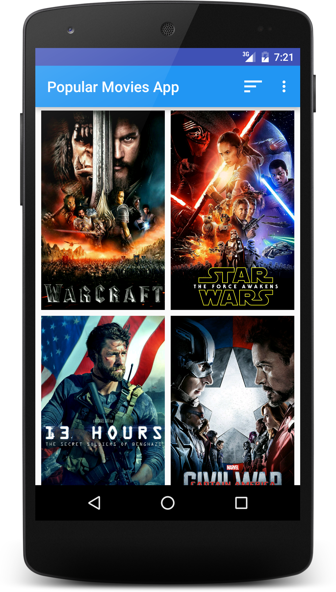
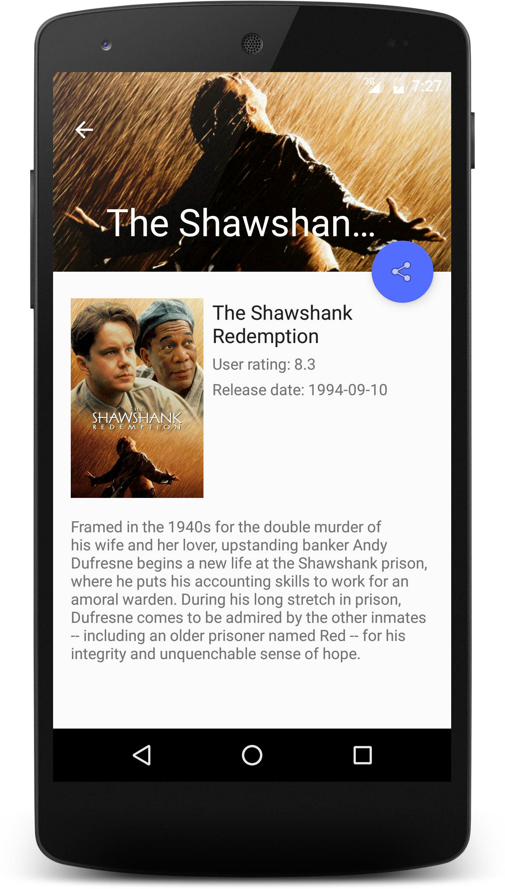

# Popular Movies App [](https://travis-ci.org/maksim-m/Popular-Movies-App)

A simple Android app, that helps user to discover movies. 
This is Project 1 & Project 2 of Udacity's Android Developer Nanodegree.

Currently in development.

## Screenshots



## Roadmap
- [X] Display movie posters in grid
- [X] Show additional information on a detail screen
- [X] Allow user to change sort order 
- [X] Continuous integration
- [X] Add code quality tools (Checkstyle, FindBugs, PMD, Android Lint)
- [ ] Offline work
- [ ] Allow user to mark a movie as a favorite
- [ ] Tablet UI
- [ ] Display trailers
- [ ] Display reviews

## API Key
The app uses themoviedb.org API to get movie information and posters. You must provide your own [API key](https://www.themoviedb.org/documentation/api) in order to build the app.

Just put your API key into `~/.gradle/gradle.properties` file (create the file if it does not exist already):

```gradle
MY_MOVIE_DB_API_KEY="abc123"
```
