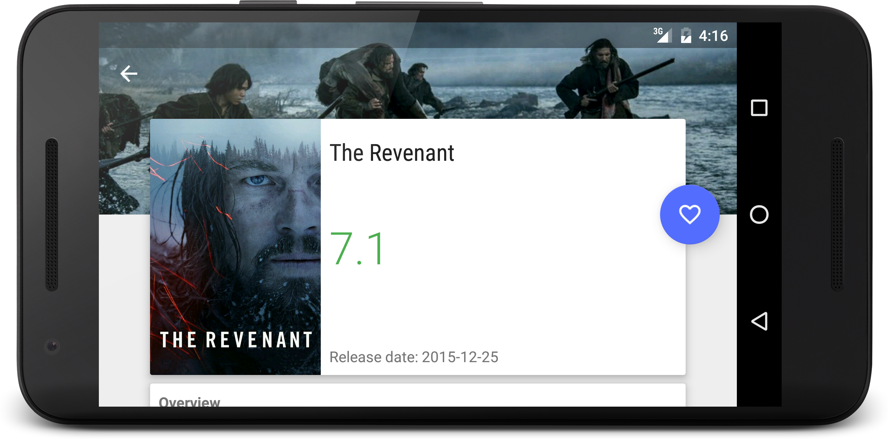

Popular Movies App
==================

[](https://travis-ci.org/maksim-m/Popular-Movies-App)

A simple Android app, that helps user to discover movies. 
This is Project 1 & Project 2 of Udacity's Android Developer Nanodegree.

Currently in development.

Screenshots
-----------




Roadmap
-------

### To Do:
- [X] Allow user to mark a movie as a favorite
- [X] Tablet UI
- [ ] Display trailers
- [ ] Display reviews

### Done in v1.0:
- [X] Display movie posters in grid
- [X] Show additional information on a detail screen
- [X] Allow user to change sort order 
- [X] Continuous integration
- [X] Add code quality tools (Checkstyle, FindBugs, PMD, Android Lint)
- [X] Offline work

Developer setup
---------------

### Requirements
- Java 8
- Latest version of Android SDK and Android Build Tools

### API Key
The app uses themoviedb.org API to get movie information and posters. You must provide your own [API key][1] in order to build the app.

Just put your API key into `~/.gradle/gradle.properties` file (create the file if it does not exist already):

```gradle
MY_MOVIE_DB_API_KEY="abc123"
```

License
-------

    Copyright 2016 Maksim Moiseikin

    Licensed under the Apache License, Version 2.0 (the "License");
    you may not use this file except in compliance with the License.
    You may obtain a copy of the License at

       http://www.apache.org/licenses/LICENSE-2.0

    Unless required by applicable law or agreed to in writing, software
    distributed under the License is distributed on an "AS IS" BASIS,
    WITHOUT WARRANTIES OR CONDITIONS OF ANY KIND, either express or implied.
    See the License for the specific language governing permissions and
    limitations under the License.

[1]: https://www.themoviedb.org/documentation/api
